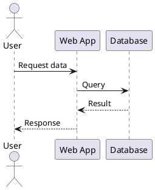

---

## 📊 Example: Sequence Diagram

```plantuml
@startuml
actor User
participant "Web App" as WA
participant "Database" as DB

User -> WA: Request data
WA -> DB: Query
DB --> WA: Result
WA --> User: Response
@enduml
```